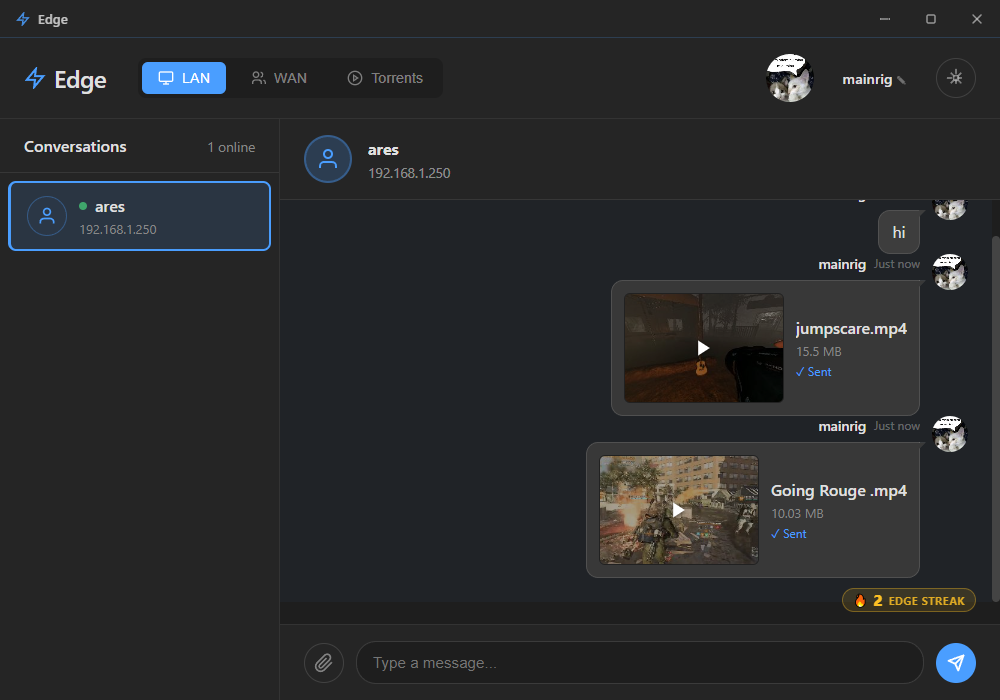
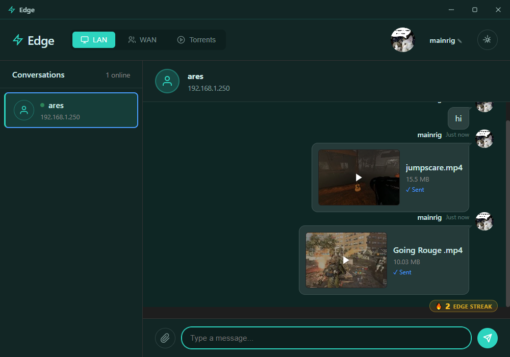
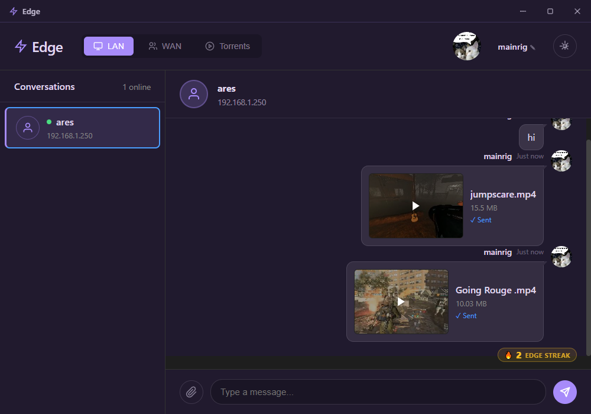

# ⚡ Edge


<p >
<strong>Fast file transfer over LAN, WAN, and
BitTorrent.</strong>
<br>When someone needs a file,
just <strong>edge it to them.</strong>
</p>
------------------------------------------------------------------------

## 📸 Screenshots




------------------------------------------------------------------------

# 🚀 What is Edge?

Edge is a modern desktop file transfer application built with:

-   Electron
-   Node.js
-   WebTorrent

The name was inspired by **edge routers** which are "located at the boundary of a network (the "edge") that connects an internal Local Area Network (LAN) to external networks". And definitely nothing else.


### ✨ Features

-   ⚡ Extremely fast LAN transfers & chat
-   🌍 Direct WAN peer-to-peer transfers
-   🎨 Customizable themes
-   🧲 Torrent client baked in
-   🔥 Edge Streak system

------------------------------------------------------------------------

# 🧠 Core Philosophy

Edge is designed to be:

-   **Direct** -- No cloud middleman required, especially for LAN. 
-   **Efficient** -- No unnecessary hops or looking for usb drives.
-   **Simple to navigate & use**

If someone needs a file:

> **Just edge it to them.**

------------------------------------------------------------------------

# 🌐 Transport Modes

## ⚡ LAN Mode

-   Automatic peer discovery
-   Zero configuration
-   Direct socket connection
-   Same-network optimized
-   Extremely fast (limited by LAN/disk bandwidth)

------------------------------------------------------------------------

## 🌍 WAN Mode (testing still underway)

-   Direct peer-to-peer transfer
-   Requires public reachability or relay
-   No persistent storage server

------------------------------------------------------------------------

## 🧲 Torrent Mode

-   Powered by WebTorrent
-   Stream video files
-   Default trackers list available in settings

------------------------------------------------------------------------

# 🔥 Edge Streak

An Edge Streak occurs when:

-   You send multiple files
-   The receiver sends nothing back
-   The streak counter increments

Is it useful?\
**Yes. To see how many files were sent in total.**

Is it slightly competitive?\
**Also yes.**

------------------------------------------------------------------------

# 📦 Installation

## Option 1 --- Download Binary

Prebuilt binaries are available in the Releases section:

-   Windows `.exe`

Download, run, **edge**.

------------------------------------------------------------------------

## Option 2 --- Build From Source

``` bash
git clone https://github.com/foooooooooooooooooooooooooootw/Edge.git
cd Edge
npm install
npm run build
```

Start without building:
``` bash
npm start
```

Start in development mode:

``` bash
npm run dev
```
------------------------------------------------------------------------

# 🔐 Privacy

-   No central file storage
-   No telemetry at all
-   No hidden cloud fallback

**Edge does not upload your files anywhere**

> **We don't know when you Edge**

------------------------------------------------------------------------

# 🗺 Roadmap

-   NAT traversal improvements
-   Resume interrupted transfers
-   Transfer throttling

------------------------------------------------------------------------

# 💬 Final Words

Edge exists because sending files shouldn't require:

-   Uploading to a random cloud
-   Waiting for indexing
-   Sharing public links
-   Paying for bandwidth twice
-   Having to abide by file size limits
-   Scrambling for a thumbdrive whenever you want to transfer files from a device to another

Sometimes you just want to say:

> **"Just edge it to me."**
